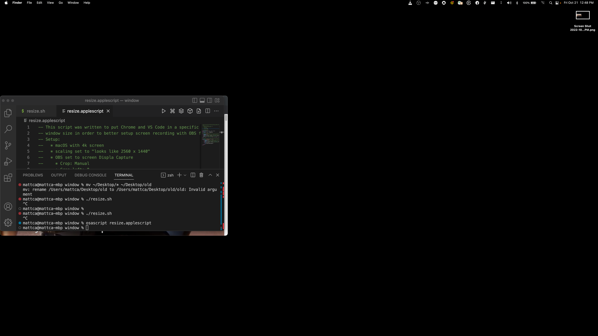
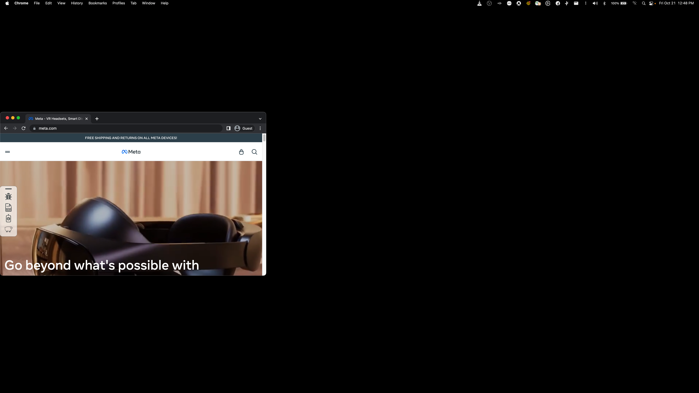

### macOS window resizing script
This script was written to put Chrome and VS Code in a specific location with a specific window size in order to better setup screen recording with OBS for livestreaming on macOS.

Extensive tweaking to the appHeight, appWidth, xAxis, yAxis, xAxisOffset, and yAxis offset is required for different applications, monitor resolutions, scaling, and OBS settings.

To run this script, change directory to the repo root in the terminal and type `osascript resize.applescript` and press enter.

### Setup
The script is currently tailored for the following setup:
* macOS with 4k screen
* scaling set to "looks like 2560 x 1440"
* OBS set to screen Display Capture
  * Crop: "Manual"
  * Crop left: `0`
  * Crop top: `900`
  * Crop right: `3200`
  * Crop bottom: `900`

### Screenshots
The script will rearrage Chrome and VS code to the following window size and location on a 4k screen with scaling to 1400p:

